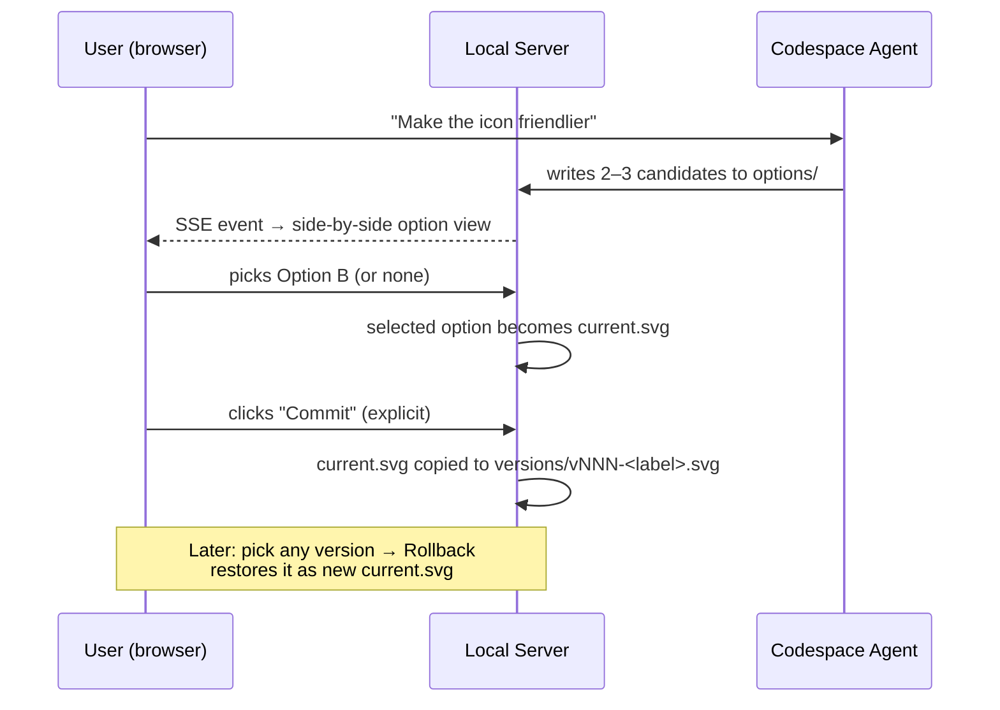

# PLAN.md — svg-creator

**Vision:** A local workspace where a human and an AI agent iteratively design SVGs together.
The agent produces work step-by-step, the local server displays every step instantly, and the
human stays in control of what gets kept.

---

## 1. Core Concepts

| Concept | Description |
|---|---|
| **Iterative design loop** | The AI presents its work at *every* step. When a modification is requested, the AI presents **multiple options** rather than a single answer, so feedback happens constantly. |
| **Per-SVG version folders** | Each SVG gets its own folder holding all committed versions from the iteration history. |
| **User-controlled commits** | Nothing is saved to history automatically. The user explicitly decides which SVG state is worth committing ("keep this point"). |
| **Rollback to known points** | Because commits are explicit, the user can always roll back and resume iterating from a known good state. |
| **Forks** | Branch off from the current state *or* any committed version into a new independent project with fresh history. Lineage is recorded in the fork's `meta.json`. |
| **Codespace agent as first-class client** | A coding agent (e.g., GitHub Copilot in Codespaces) working inside the project is a *primary* way to drive the server — alongside the browser UI. |

---

## 2. Current State

**M1 complete.** The server is project-based with versioning, rollback, and forks.

- ✅ Express server (`server.js`) + static SPA UI (`public/index.html`) on port 3000
- ✅ Project folders: `public/svgs/<project>/{current.svg, meta.json, versions/, options/}`
- ✅ `GET /api/projects`, `POST /api/projects` — list / create projects
- ✅ `GET|PUT /api/projects/:name/current` — read / write working copy (agent-friendly:
  accepts raw SVG or `{"svg": "..."}`)
- ✅ `POST /api/projects/:name/commit` — commit current → `versions/vNNN-<label>.svg`
- ✅ `GET /api/projects/:name/versions`, `GET .../versions/:id` — history
- ✅ `POST /api/projects/:name/rollback/:id` — restore version into current
  *(decision: rollback does **not** auto-commit; commits stay human-gated)*
- ✅ `POST /api/projects/:name/fork` — fork from current or a specific version into a new
  project with fresh history; lineage stored in `meta.json`
- ✅ **Agent Target button** — user explicitly clicks 🎯 Target in the viewer header to
  mark which project agents should edit (`GET|PUT /api/focus`, persisted as `.focus.json`
  in `svgs/`; readable via HTTP *or* filesystem). The targeted project shows a 🎯 marker
  in the sidebar. Deliberately manual — no automatic tracking of UI selection.
- ✅ **Live toggle** *(on by default)*: SSE (`GET /api/events`) with classified events
  `projects-changed` / `current-changed` / `versions-changed` / `options-changed`
  *(fs.watch + 800ms mtime-poll fallback — some container filesystems never deliver
  inotify events)*
- ✅ UI: project sidebar (+ New), history panel (preview / restore), commit bar,
  Fork button, "Fork from here" when previewing a snapshot
- ✅ **Project deletion** — red Delete button with confirmation dialog; server requires
  `{confirm: true}` as a second guard
- ✅ **Version deletion** — checkboxes in History + "Delete selected (N)" button;
  confirmation dialog lists exactly which versions will be removed
- ✅ Sample project at `public/svgs/sample/` with two committed versions

Not yet built: options workflow (M2), agent conventions doc (M3), diff view (M4).

---

## 3. Proposed Architecture

### 3.1 Directory layout (file-based, agent-friendly)

```
public/svgs/
└── <project-name>/            # one folder per SVG being designed
    ├── current.svg            # the working copy — always what's displayed live
    ├── meta.json              # name, description, iteration notes
    ├── versions/              # explicit user-committed checkpoints
    │   ├── v001-initial-concept.svg
    │   ├── v002-thicker-strokes.svg
    │   └── v003-color-palette.svg
    └── options/               # transient AI-proposed alternatives (cleared on selection)
        ├── option-a-higher-contrast.svg
        ├── option-b-rounded-corners.svg
        └── option-c-minimal.svg
```

**Why file-based?** A codespace agent can participate by simply reading/writing files with
normal tools — no HTTP calls required. The HTTP API mirrors the same structure for the
browser UI (and for agents that prefer REST).

### 3.2 Interaction model



Key rules:

1. **Every step is visible.** The agent never batch-dumps final output; each intermediate
   result lands in `current.svg` (or `options/`) and appears immediately.
2. **Modifications produce options — when they're open-ended.** Default expectation:
   ≥2 alternatives per modification request, unless the user asks for a single direct edit
   or the change is trivial/unambiguous (see §4).
3. **Commits are human-gated.** Only the user commits. Agents may *suggest* committing.
4. **Rollback is non-destructive.** Rolling back to v002 does not delete v003+; it creates a
   new working state (optionally auto-committing a "rollback marker" version).

### 3.3 Planned HTTP API

| Method | Path | Purpose |
|---|---|---|
| `GET` | `/api/projects` | List all SVG projects |
| `POST` | `/api/projects` | Create a new project `{ name }` |
| `DELETE` | `/api/projects/:name` | Delete entire project — requires `{confirm: true}`; UI asks first |
| `GET` | `/api/projects/:name/current` | Fetch working copy |
| `PUT` | `/api/projects/:name/current` | Write working copy (agent-friendly) |
| `GET` | `/api/projects/:name/options` | List pending options (+ committed flags) |
| `POST` | `/api/projects/:name/options` | Submit a round `{options:[{label,svg}], append?}` — replaces by default |
| `GET` | `/api/projects/:name/options/:id` | Fetch one option's SVG |
| `DELETE` | `/api/projects/:name/options` | Dismiss all options |
| `DELETE` | `/api/projects/:name/options/:id` | Dismiss one option |
| `POST` | `/api/projects/:name/select` | Promote an option to `current.svg` (option stays in tray) |
| `POST` | `/api/projects/:name/commit` | Commit current → `versions/vNNN-<label>.svg`; or **direct-commit an option** via `{option: id}` (✓ marked, stays in tray) |
| `GET` | `/api/projects/:name/versions` | List versions (+ timestamps, labels) |
| `GET` | `/api/projects/:name/versions/:id` | Fetch one version |
| `POST` | `/api/projects/:name/versions/delete` | Bulk-delete versions `{ids, confirm: true}` — UI confirms first |
| `POST` | `/api/projects/:name/rollback/:id` | Restore version as current (no auto-commit) |
| `POST` | `/api/projects/:name/fork` | Fork to new project `{ name, version? }` — fresh history, lineage in meta.json |
| `GET` | `/api/focus` | Which project the user 🎯-targeted for agents |
| `PUT` | `/api/focus` | Set agent target `{ project }` — written by the UI Target button |
| `GET` | `/api/events` | SSE stream — events: `projects-changed`, `current-changed`, `versions-changed`, `options-changed` |

### 3.4 UI additions

- **Options tray:** side-by-side rendering of everything in `options/`, click to select,
  "none of these" to dismiss.
- **History panel:** version list with inline thumbnails, labels, timestamps;
  actions: *Preview*, *Restore*, *Compare*.
- **Commit bar:** label input + Commit button (disabled hint when `current.svg` matches
  last commit).
- **Diff view (later):** overlay/side-by-side compare of two versions or current vs. version.

---

## 4. Agent Integration (AGENTS.md conventions)

Create an `AGENTS.md` at repo root teaching any coding agent the workflow:

1. **Read before writing:** check `meta.json` and latest versions to understand context.
2. **Present, don't overwrite blindly:** for *open-ended* modifications, write 2–3 labeled
   files into `options/`; tell the user to look at the browser and pick.
3. **No options for simple asks.** If a request has one obvious result — a stroke-width
   change, a named color swap, a text edit — apply it directly to `current.svg`. Don't
   manufacture alternatives for unambiguous edits; options rounds are for subjective or
   directional feedback ("make it friendlier", "warmer palette") where comparing variants
   actually helps.
4. **Never commit on the user's behalf.** Suggest it instead: *"Looks good — want to commit
   this as v004?"*
5. **Naming:** options are `option-<letter>-<short-label>.svg`; versions are
   `vNNN-<short-label>.svg`.
6. **After writing files, wait for the SSE-driven UI update** — no need to poll.
7. **"Commit" means svg-creator commit** — writing `current.svg` into the project's
   `versions/` folder via the commit endpoint/UI button. It has **nothing to do with git**.
   Only run `git commit` / touch the repository when the user explicitly says
   "git commit" (or similar). When in doubt, ask which one they mean — never conflate them.
8. **Stay quiet: file tools over terminal.** Do all agent work — reading `.focus.json`,
   reading/writing `current.svg`, and submitting options — with file tools
   (`read_file` / create / edit), never terminal commands (`curl`, `cat`, `echo >`).
   Terminal calls spam the user's session and were explicitly rejected. Submitting an
   options round quietly = creating the files directly in
   `public/svgs/<project>/options/` using the naming convention above; the server's
   watcher detects them within ~800ms and the tray updates live.

### 4.1 Targeting protocol — "quiet focus" *(agreed with user)*

The user marks the project agents should edit by clicking **🎯 Target** in the UI, which
writes `public/svgs/.focus.json`. Agents must resolve the edit target like this:

1. **If the user names a project in chat, that wins.** Never second-guess an explicit name.
2. **Otherwise, read `.focus.json` quietly** — with file-read tools (`read_file`), *not*
   terminal commands (`curl`, `cat`). Terminal calls are noisy, spam the user's session,
   and were explicitly rejected ("let's do it quietly").
3. **No target set? Ask.** One short question beats guessing and editing the wrong project.
4. **Never assume** the project visible/on-screen in the user's browser is the target —
   there is no automatic selection tracking (tried and removed; see Current State).

**Sync both directions:** when the user names a project in chat, the agent must also
*update* `.focus.json` (again via quiet file edits) so the site's 🎯 marker moves to match.
The server emits a `focus-changed` SSE event when that file changes, and the UI re-renders
the marker live — no refresh needed.

**Always write on chat switch — even if the content looks unchanged.** Skipping the write
when the file "already matches" risks leaving a stale UI marker forever out of sync (this
bug happened). Rewriting the file is idempotent and forces the `focus-changed` event that
resyncs any listening browser. Note: live marker movement requires the browser's **Live**
toggle to be on; otherwise the marker updates on next refresh.

This section is the source of truth until `AGENTS.md` exists (M3); copy it there verbatim.

---

## 5. Milestones

### M1 — Project folders & versioning ✅ *(done)*
- [x] Migrate flat `public/svgs/*.svg` layout to `<project>/current.svg`
- [x] Implement commit endpoint + `versions/` management
- [x] Implement rollback endpoint (no auto-commit)
- [x] Update UI: project list, history panel, commit bar, restore buttons
- [x] Migration of existing `sample.svg`
- [x] Fork support: from current state or any version, with lineage in `meta.json`

### M2 — Options workflow ✅ *(done)*
- [x] Options endpoints + `options/` handling (rounds: replace-by-default, append opt-in)
- [x] Side-by-side options tray: Use (promote), **direct commit** (✓ marker, option stays),
      per-option ✕ and "Dismiss all"
- [x] SSE `options-changed` wired to the tray
- [x] Full flow curl-tested: submit round → direct-commit 2 of 3 → promote the third →
      append → new round sweeps → dismiss all

### M3 — Agent conventions *(next up)*
- [ ] Write `AGENTS.md` with the workflow rules above
- [ ] Smoke-test the full loop: agent proposes options → user selects → user commits →
      agent rolls back on request

### M4 — Polish
- [ ] Diff/compare view between any two states
- [ ] Version annotations/notes in `meta.json`
- [ ] Keyboard shortcuts (commit, cycle options)
- [ ] Optional: export bundle (zip of project with history)

---

## 6. Open Questions

1. ~~Should committing snapshot *only* `current.svg`, or also allow committing a chosen
   option directly without promoting it first?~~
   **Decided:** direct commit — committing straight from an option is allowed, no forced
   promote-to-current step.
2. ~~Max number of pending options before old ones auto-dismiss?~~
   **Decided:** no numeric cap, no auto-delete. Options are organized in **rounds**
   (one batch per modification request):
   - A new agent-proposed round replaces the previous batch by default (`append` mode
     opt-in for cross-round comparison)
   - **Committing an option never removes it** — it stays in the tray marked ✓ committed,
     so multiple variants can be committed before any dismissal
   - Dismissal is always explicit: per-option ✕ or "Dismiss all"
   - UI shows latest round expanded; older rounds (if kept) collapsed
3. ~~Should rollback create a new version entry (audit trail) or silently replace current?~~
   **Decided:** rollback replaces `current.svg` only — no auto-commit. The user can commit
   the restored state explicitly if they want it in history.
4. Do we ever want git integration (real branches/tags per version), or is the folder-based
   history sufficient? *(Folder-based keeps agents simple; git adds safety. Could be both.
   Forks currently cover the "divergent directions" use case without git.)*
5. Multi-user/multi-tab behavior: last-writer-wins is fine for now?

---

## 7. How to Run (today)

```bash
npm install
npm start          # http://localhost:3000
npm run dev        # same, with node --watch auto-restart on server code changes
```

Each SVG lives in `public/svgs/<project>/current.svg`. Enable the **Live** toggle in the
header to auto-refresh as files change, or just hit Refresh. Agents can write directly to
`current.svg` or use `PUT /api/projects/<project>/current`.
